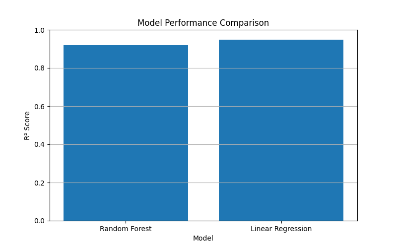
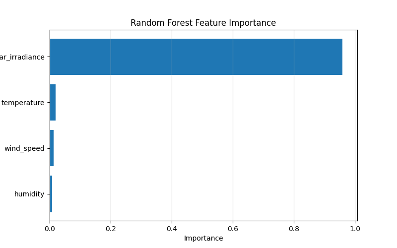

# Solar Power Prediction System

## Project Overview

This project develops a machine learning-based system for predicting solar power output using environmental and weather-related parameters.

The current version uses a synthetically generated dataset to develop and test the machine learning workflow.

## Input Features

The model uses the following parameters:

* Solar irradiance
* Temperature
* Humidity
* Wind speed

## Machine Learning Model

A **Random Forest Regression** model is used to predict solar power output.

The dataset is divided into training and testing sets. The model is trained using the training data and evaluated using the testing data.

## Model Evaluation

The model is evaluated using:

* Mean Absolute Error (MAE)
* Mean Squared Error (MSE)
* Root Mean Squared Error (RMSE)
* R² Score

The current model achieved an R² score of approximately **0.92** on the test dataset.
## Model Comparison

Two regression models were evaluated for solar power prediction:

| Model | MAE | RMSE | R² Score |
|---|---:|---:|---:|
| Random Forest | 27.26 | 35.27 | 0.920 |
| Linear Regression | 21.12 | 28.67 | 0.947 |

The comparison shows that both models achieved strong performance on the synthetic dataset, with Linear Regression obtaining a higher R² score for this particular dataset.



> Note: These results are based on a synthetically generated dataset and should not be interpreted as real-world solar forecasting performance.
> Note: The current dataset is synthetically generated for project development and testing. Therefore, the reported performance does not represent performance on real-world solar power data.
## Feature Importance

Random Forest feature importance was analyzed to understand the contribution of each input feature to the prediction model.

The analysis considers:

- Solar irradiance
- Temperature
- Humidity
- Wind speed



> Note: Feature importance reflects the behavior of the Random Forest model trained on the synthetic dataset. It should not be interpreted as a causal relationship.

## Project Structure

```text
solar_power_prediction_system/
│
├── data/
│   ├── solar_data.csv
│   ├── prediction_result.csv
│   └── solar_irradiance_vs_power.png
│
├── notebooks/
│   └── 01_explore_data.py
│
├── src/
│   ├── data_generator.py
│   ├── model_training.py
│   ├── predict_power.py
│   └── solar_power_model.pkl
│
└── README.md
```

## Technologies Used

* Python
* Pandas
* NumPy
* Scikit-learn
* Matplotlib
* Joblib

## Current Workflow

1. Generate the solar dataset.
2. Explore and analyze the dataset.
3. Visualize the relationship between solar irradiance and power output.
4. Train a Random Forest Regression model.
5. Evaluate the model using regression metrics.
6. Use the trained model to predict solar power output for new conditions.

## Future Improvements

* Replace the synthetic dataset with real-world solar power data.
* Add time-based features such as hour, day, and month.
* Compare multiple machine learning algorithms.
* Perform hyperparameter tuning.
* Develop solar power forecasting using historical time-series data.
* Add renewable energy and energy management applications.
* Develop a user interface for real-time prediction.
